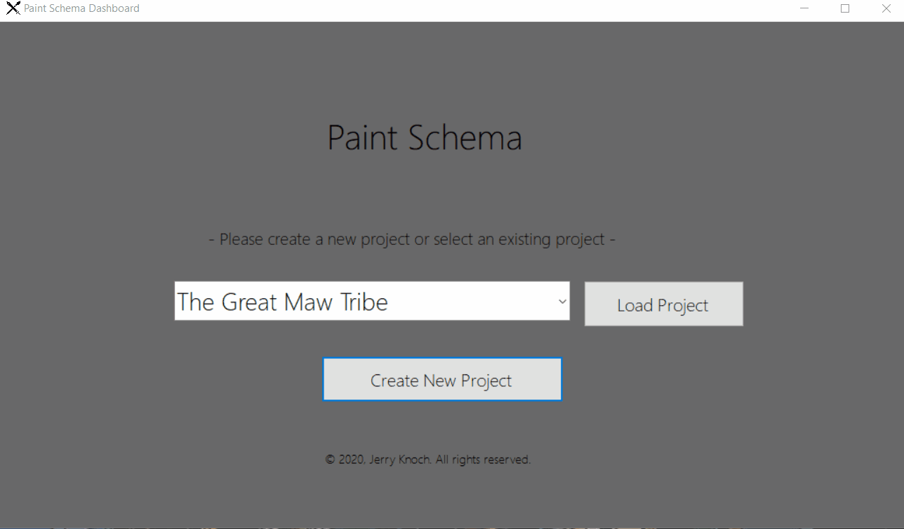
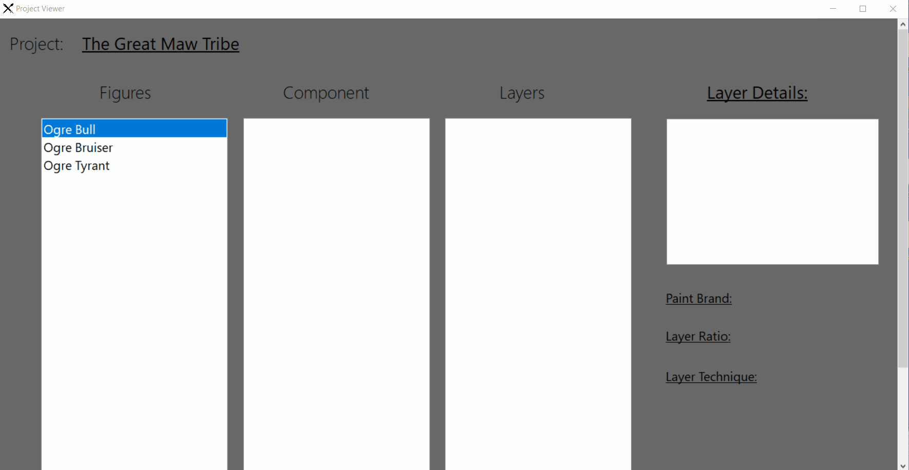

# Jerry Knoch PaintSchema Demo

## Introduction

This is a demo for the application I developed in C# to aid miniature model artists
in saving details about their paint schemes for commissions. Many projects for miniature
model painters involve hundreds of models that include several details about paints
and the techniques used to paint each component of the model. Having the ability to save
and lookup details on projects helps to aid in expediting painting projects.

## Startup Dashboard

Here we can select to load a previously saved project, or to create a new project.

## Project Dashboard

Here we have several lists which are used to display the various models. The user selects
a model, then a component, then a layer to finally display notes about that part in the 
paint scheme. The user can also select the paints to see specific details on the brand for
that given paint.

## Create New Project

TODO

## Create New Figure/Component/Layer

TODO

## Create New Paint

TODO

## Looking Forward
This project is still being added to and will have more updates to come!

### Copyright Jerry Knoch 2020